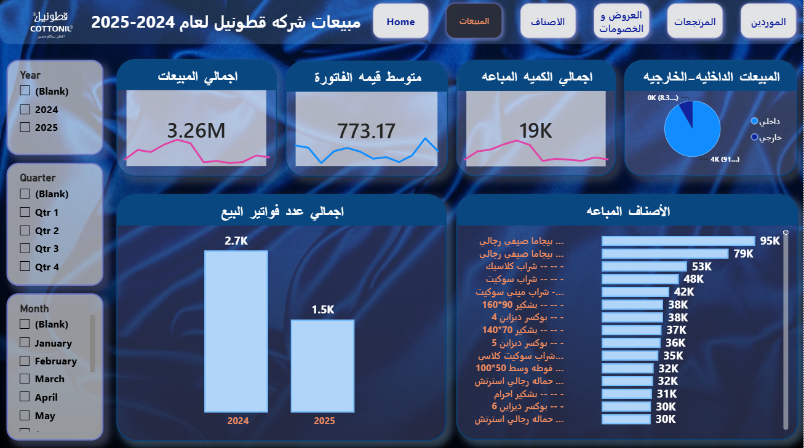
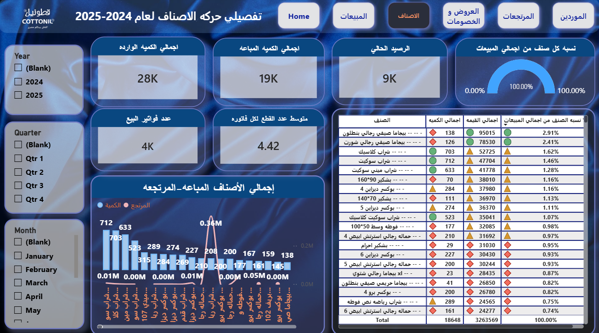
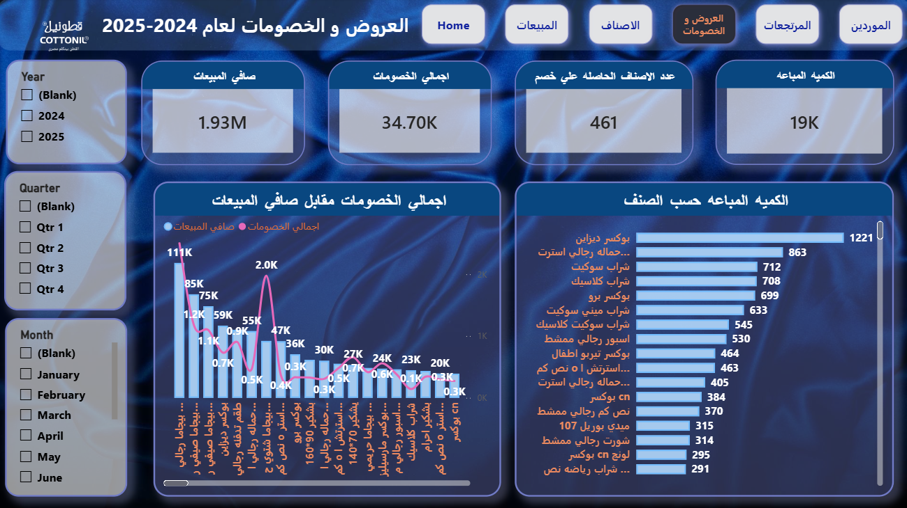
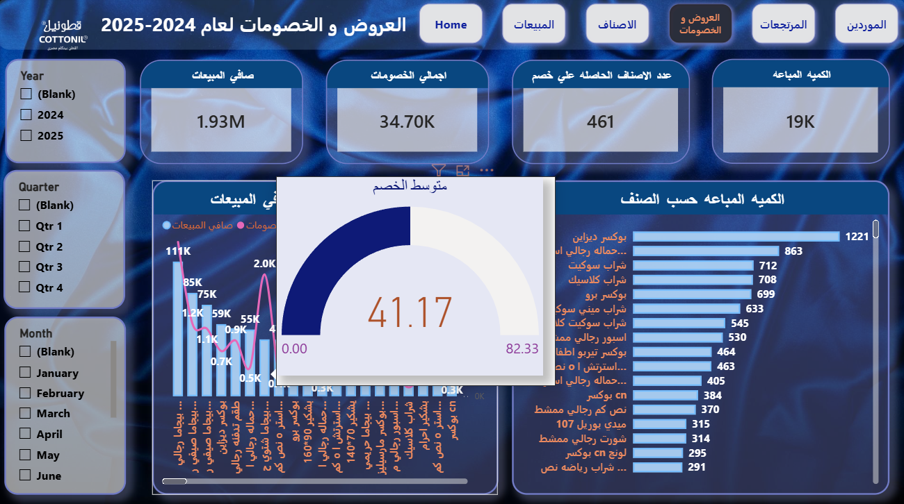
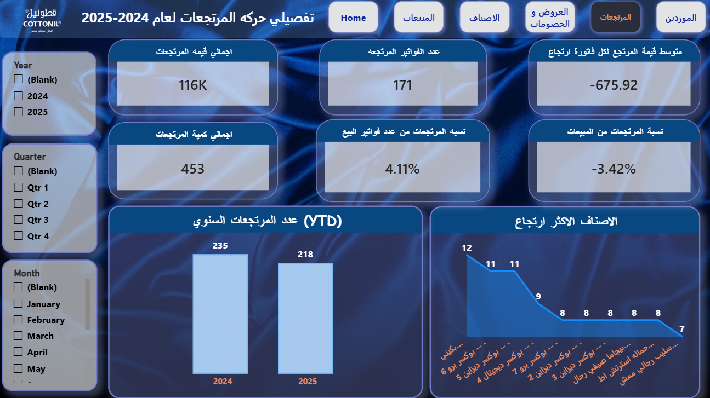
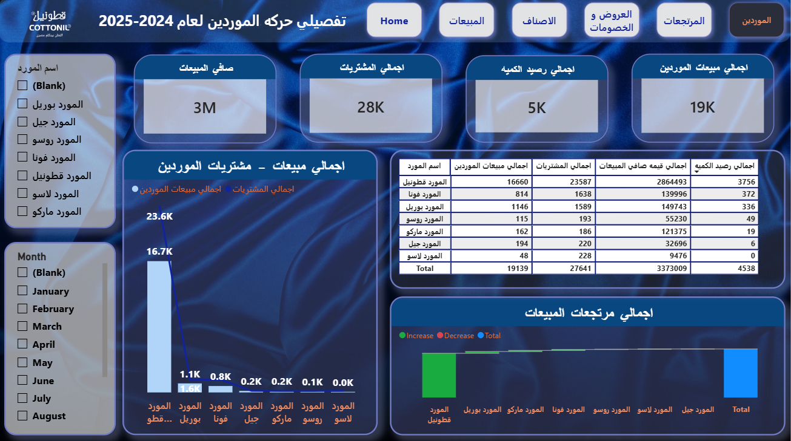

# COTTONIL-Retail-Analytics-Power-BI-Report
A Power BI analytics solution for COTTONIL, a retail and inventory business, providing end-to-end visibility into sales, item movement, promotions and discounts, returns, and supplier accounts. Powered by 30+ DAX measures organized into structured, maintainable KPI tables.

**Live Report:** [COTTONIL — Power BI](https://app.powerbi.com/groups/me/reports/02827bec-3419-4f20-bbb2-a9a99619d812/0b597587bbb73e96820c?experience=power-bi)

---

## Overview

The report is organized into six pages, navigated through a consistent top nav bar. Each page uses Year / Quarter / Month slicers on the left and KPI cards with sparklines at the top, following a unified visual template throughout with a dark blue theme and card-based KPI tiles.

## Report Pages

### 1. Home

Landing page with brand identity and navigation buttons to all five analytical sections: Sales, Items, Promotions & Discounts, Returns, and Suppliers.

### 2. Sales (المبيعات)

High-level sales performance for 2024–2025.

- Total sales, average invoice value, total quantity sold
- Internal vs. external sales split (pie chart)
- Total sales invoice count by year
- Top-selling items by quantity

### 3. Items (الاصناف)

Item-level movement detail: incoming quantity, quantity sold, and current stock balance.

- Total quantity received, quantity sold, current balance
- Each item's percentage share of total sales
- Invoice count and average line items per invoice
- Combined sold vs. returned quantity by item, with a full item breakdown table (quantity, value, % of total sales)

### 4. Promotions & Discounts (العروض و الخصومات)

Tracks the impact of discounting on net sales.

- Net sales, total discount value, quantity sold under discount
- Count of items that received a discount
- Net sales vs. total discounts trend by item
- Quantity sold by item under promotion
- Average discount value (gauge visual)

### 5. Returns (المرتجعات)

Return activity and its effect on overall sales.

- Total return value, number of return invoices, average value per return invoice
- Total returned quantity
- Return rate as a percentage of total sales invoices
- Return rate as a percentage of total sales value
- Year-over-year (YTD) return invoice count
- Top 10 most-returned items

### 6. Suppliers (الموردين)

Supplier-level breakdown of sales and purchasing activity, aggregated across all seven suppliers (بوريل، جيل، روسو، فونا، قطونيل، لاسو، ماركو).

- Net sales, total purchases, total quantity balance, total supplier sales
- Sales vs. purchases by supplier (bar/line combo)
- Full supplier table: sales quantity, purchases, net sales value, quantity balance
- Total returns by supplier

---

## Tech Stack

- **Tool:** Power BI Desktop
- **Data model:** Star-schema style tables for sales, purchases, inventory, supplier accounts, and returns, with dedicated calculated KPI tables per analytical domain
- **Measures:** 30+ DAX measures organized under nested display folders (e.g. `Promotions & Discounts > Discount Value`)
